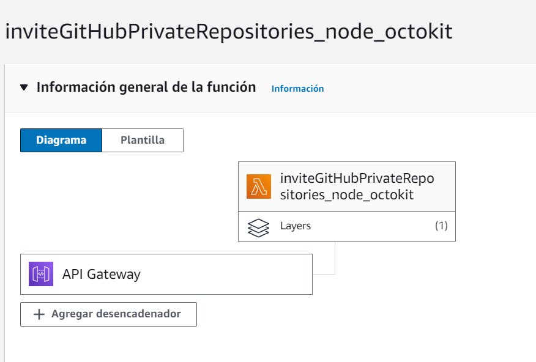
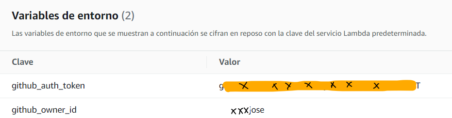
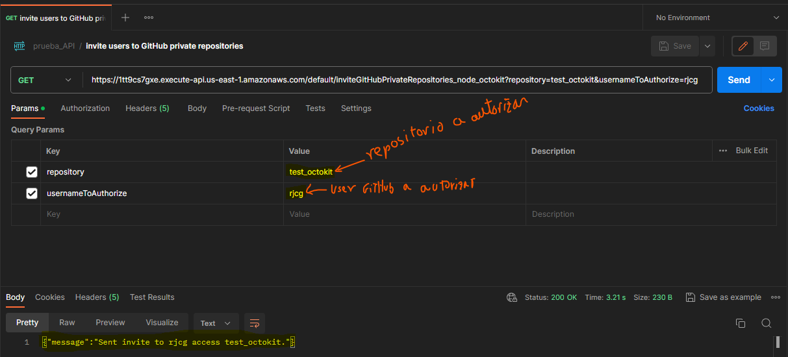

Repositorio de prueba, para estudiar como funciona la librería Octokit e interactuar con `GitHub`

### Ejemplo:
Una manera rápida de compartir un código almacenado en un repositorio GitHub para que otro lo revise; manteniendo el repositorio privado. 
Leer el código en línea es mucho más conveniente que descargar un archivo zip para un tercero.
La función AWS Lambda creada junto con la API asociada, envía una invitación para que un usuario GitHub pueda acceder a un repositorio privado.

# Como usar AWS Lambda con Node y Octokit:

### En Resumen:

a) Cree una función Lambda, para el proyecto: BancoCerebralGitHubApiOctokitNode

      MemorySize: 128
      Timeout: 3
      Handler: index.handler
      Runtime: nodejs20.x
      Architectures: x86_64

b) Cree localmente en Ubuntu (AWS) un directorio con la librería a utilizar:
	y dentro de ese directorio cree: mkdir nodejs

	~/capa_lambda_bc_node/nodejs$

c) Adicione la librería octokit (y cualquier otra que requiera):

`yarn add @octokit/rest`

d) Comprima el contenido del directorio /nodejs (el directorio inclusive) y súbalo a un Buckets de Amazon S3:

	Amazon > Buckets > bancocerebral: nodejs_para_bc.zip

e) Cree una capa de librerías para el proyecto Nodejs:

	nodejs_para_bc		Tiempo de Ejecución Compatible: nodejs20.x	 Arquitectura: x86_64

f) Asocie la capa al proyecto:

      Layers: arn:aws:lambda:us-east-1:801945930008:layer:nodejs_para_bc:1

g) Cree las Variables de entornos necesarias

    Variables de entorno (2)

	Clave                   Valor
  `github_auth_token`	ghp_$H41M=g`2v~CC(/@|zJc\I&t4~WFp4\i4FZyT
  
  `github_owner_id`	        xxxxxjose
  
  nota: **utilice los valores adecuados y reales para su proyecto.**
  
h) Asegurese que el index tenga extensión (.js); en AWS los proyectos Node se crean con extensión (.msj):
	
  `index.js`

i) Edite el script para el proyecto Nodejs y Deploy:

	La función Lambda debe de estar lista para su uso.

j) Deploy y verifique la Api desde postman, la Api debe de incluri los parámetros requeridos por la Lambda:
	URL de la Api sola:
	https://5kuqiys8a3.execute-api.us-east-1.amazonaws.com/default/BancoCerebralGitHubApiOctokitNode

	URL de la Api con los parámetros requeridos:
	

### REFERENCIA:

**How to use an AWS Lambda function to invite users to GitHub private repositories**

https://blog.giovannijoao.dev/how-to-use-an-aws-lambda-function-to-invite-users-to-github-private-repositories

Requirements
GitHub Account
AWS Account (also possible with free-tier)
NPM/YARN installed in your machine
